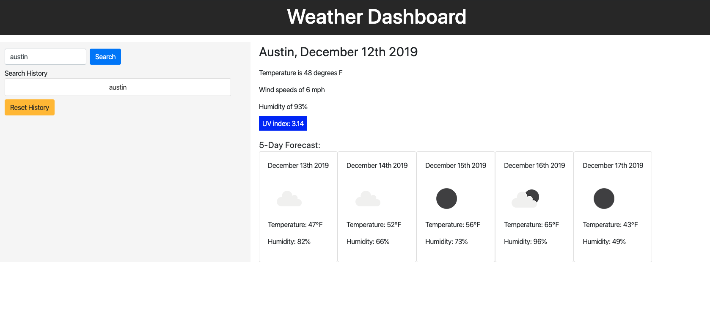
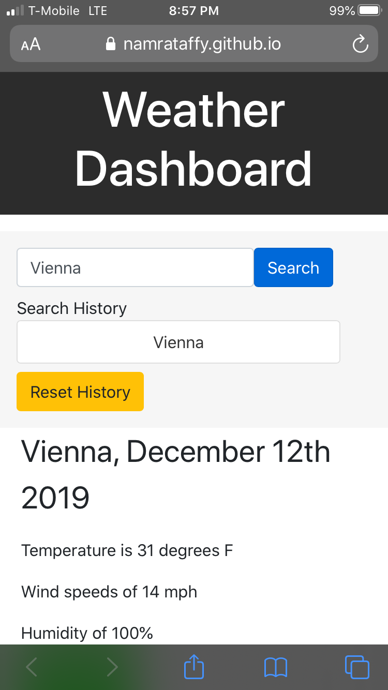
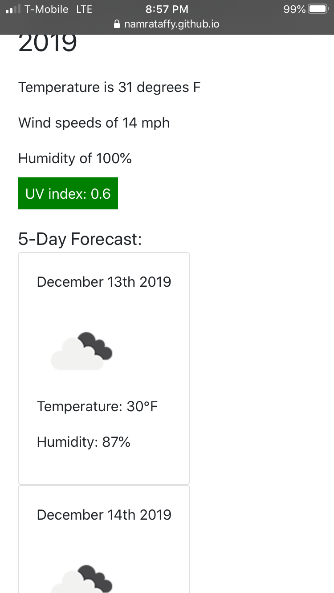

# Weather_Dashboard

<br>

# Summary

This is a weather dashboard that displays the temperature, humidity, UV index, and wind speed for a searched city. In addition, a 5-day forecast will be displayed.
<br>

# Sample Images

Home Screen

<br>
<br>
<br>
Mobile
<br>

<br>


# Technologies

- HTML
- CSS
- VScode
- Git
- GitHub
- Javascript
- Moment.js
- jQuery
- OpenWeather API

# Author

Arman Riahi

# Links

[LinkedIn](https://www.linkedin.com/in/arman-riahi/)
<br>

[GitHub](https://github.com/namrataffy)
<br>

# Code Snippet

Code showing how history is rendered:

```

function renderHistory() {
  if (!localStorage.getItem("cities")) {
    var cities = [];
    $("#newCityArea").addClass("hideBorder");
    console.log(cities);
  } else {
    var cities = JSON.parse(localStorage.getItem("cities"));
    $("#newCityArea").removeClass("hideBorder");
  }
  $("#newCityArea").empty();

  for (var i = 0; i < cities.length; i++) {
    var element = $("<button>");
    element.text(cities[i]);
    element.addClass("cityButton");
    element.attr("value", cities[i]);
    $("#newCityArea").prepend(element);
  }
}
```
